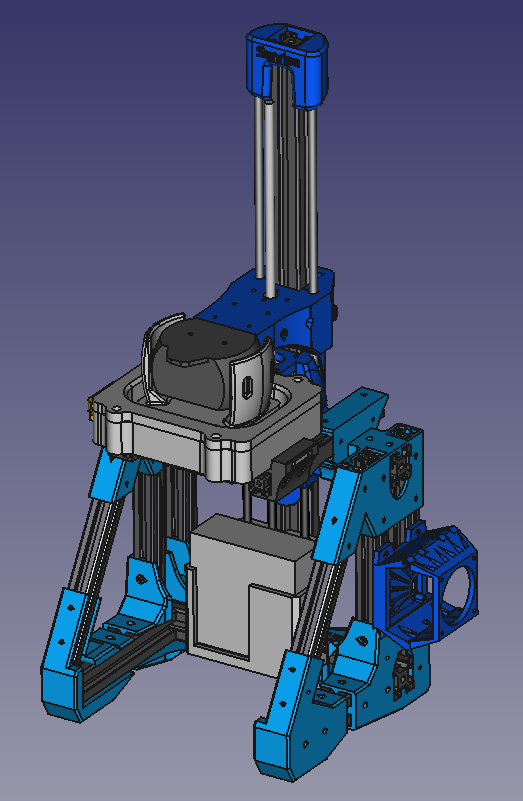
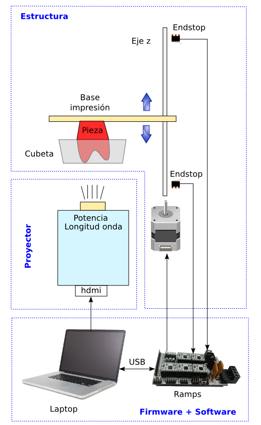
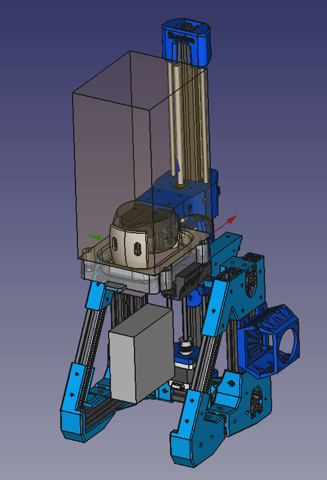
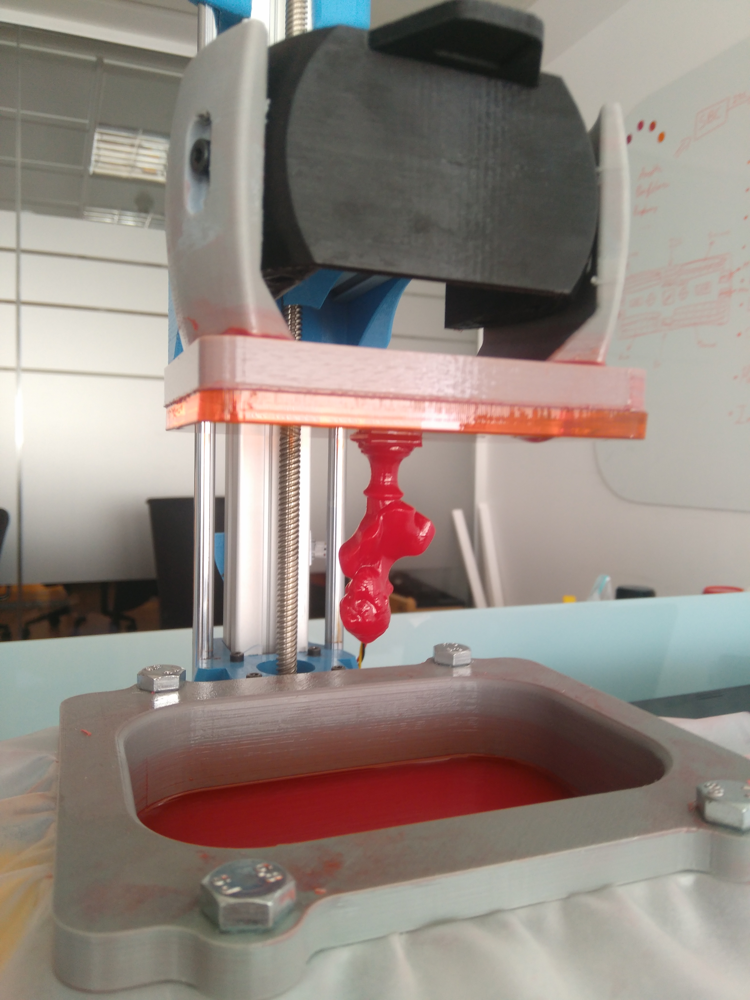
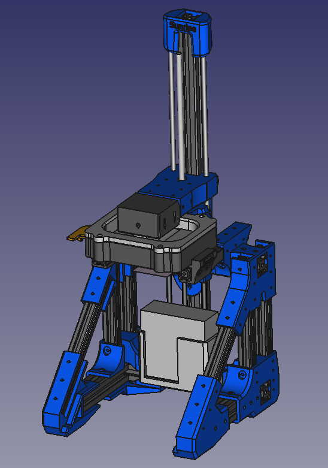
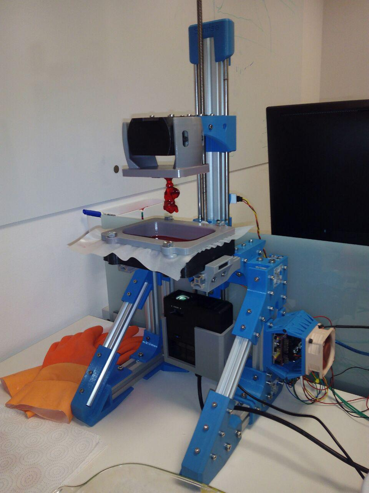
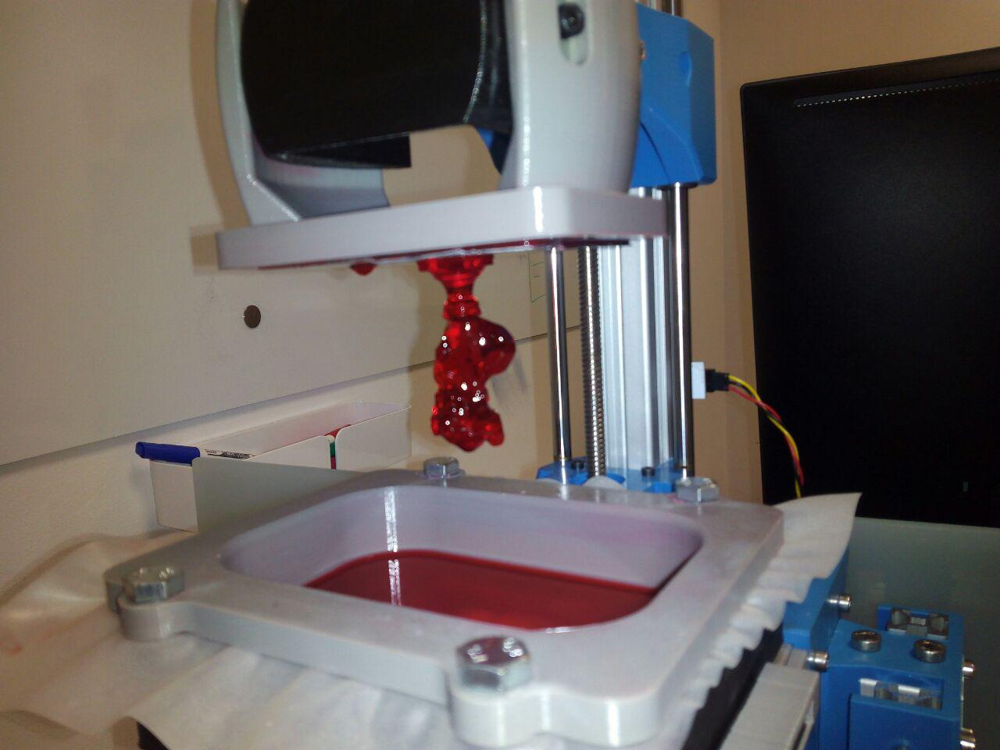
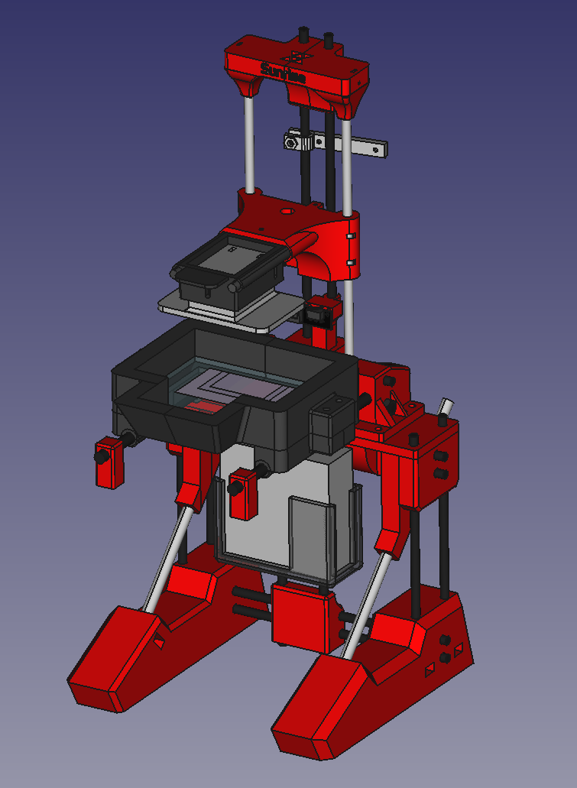
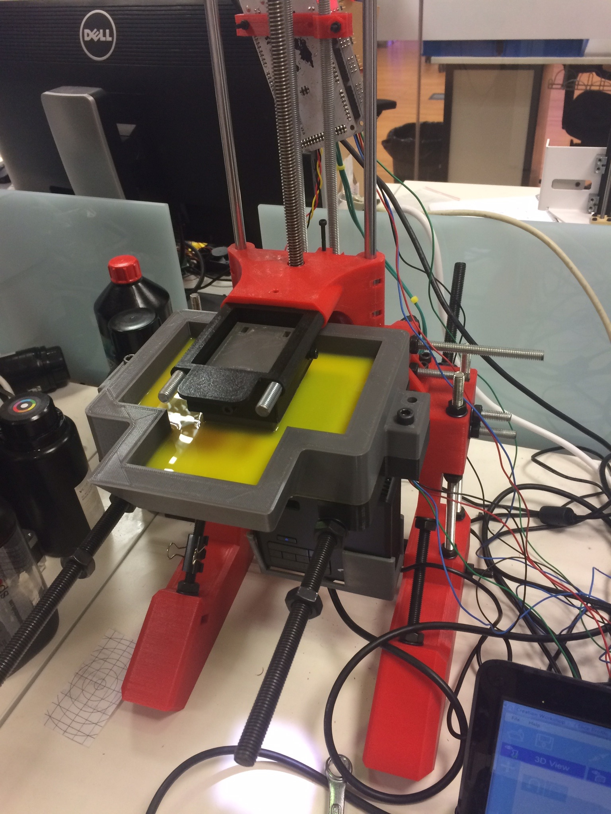
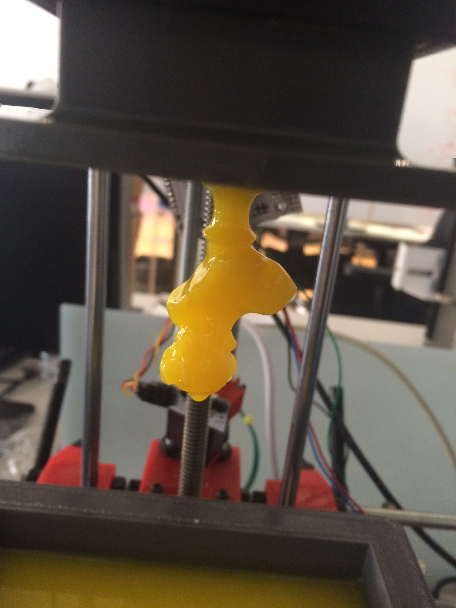

# Sunrise Project



## Introduction

The Sunrise Project is a research project, that aims to design an Open Source  hackable DLP based 3D printing system.

## Approach
The intention is to make the machine accesible to the general public. It must be sourceable, craftable, and modifiable by everyone. It aspires to be a platform for the community to explore this technology. Mechanics are scalable, source is available and modifiable, tools are open and obtainable.

## The technology

DLP 3D Printing uses photopolymierizing resin to craft the parts. Parts generate layer by layer as they are cured by a projector that outputs the cross-sections of the part, into the resin. There are various mechanical structures that can be used to achieve this.

This machine has what is called a _Bottom-Up_ structure. It has a vat, with transparent bottom, filled with resin. Underneath, an upward pointing DLP projector shoots light through the bottom window. The light striking on a **downward pointing** build surface cures the resin, forming a new layer.
Repeating this process, curing one layer below the previous one, ends up crafting the whole part, **upside down**.




## The machine


This machine tries to stick to the RepRap philosophy, so structure and moving parts are 3D printed. Motion control is performed by an Arduino with a CNCShield, running a version of [GRBL][GRBL-link] that can be found [here][Sunrise-fw].
The projector is an [Optoma ML750][Optoma-link], with hacked optics for nearer focus.
PDMS based vat and flexible bottom vat system are being considered.


## About this repo

This repo contains the mechanical structure source. The tool of use is FreeCAD.
Folder content is descripted below
* `src`: Source files and assembly.
* `Step`: Step files for CAD import.
* `stl`: stl files for 3D printing.
* `FEM`: Part file duplicates for possible FEM analysis.
* `Fonts`: Fonts used in the design of the parts.
* `doc`: useful files for documentation
* `Software`: Provisional, holds useful software until it gets big enough for it to have its own repo.

### Cloning this machine

To build this machine, you need to print the 3D printable parts in [the stl folder][stlfolder]. You need to print each file once.

You will also need:
* 1958 mm of 20x20 aluminium extrusion profile
* 1378 mm of 30x30 aluminium extrusion profile
* Smooth rods, depending on desired Zaxis length
* Hammerhead nuts (Around 196 for 20x20 profiles and 52 for 30x30)
* DIN912 M4x8 bolts for 20x20 hammerhead nuts
* DIN912 M6x10 bolts for 30x30 hammerhead nuts
* 2 M3x10 Bolts
* 1 M3x20 Bolt
* 1 M3x30 Bolt
* A hacked Optoma ML750 (Focus moved forward with a M2 nut)

The length of the pieces of aluminium profiles and smooth rods can be seen in the [assembly file][Assembly]. Due to this being still in development there's not a lot of documentation. If you have any doubts [feel free to ask in the "issues" section][issue].

**Please note:** From v0.2.5 this repo uses [Assembly 2 FreeCAD workbench][Assembly2] for the assembly. You may want to install it before opening the assembly file.

### Contributing to this repo

You can contribute to this repo by forking it, and making pull requests to the [Development branch][Develop]. If you find problems to make the contribution this way, [place an issue][issue] and we'll work it out.

Due to FCStd files being unmergeable, Assembly.FCStd is modified only on the Development branch. It may not be included in pull requests. Remember that you need [Assembly 2 FreeCAD workbench][Assembly2] to open it.

In case of contributing using gitflow, take advantage of git diff features on FCStd files, and avoid big commit files, paste this lines on your ~/.git/config:
```
[include]
    path = ../.gitconfig
```
These will include the particular repo configuration, that tells git to unzip the files before diffing them.


## History


### Sunrise v0.3 (In development)



#### Target Specs

* Easier assembly and printing.
* Build environment enclosure.
 * Must be compatible with fast vat swapping. (Vat may go out by pulling from it, rather than lifting it)
 * Zcarriage will access the environment through a bellow
 * Enclosure, VAT, and platform will come out as a whole, so uninstalling will be easier.
* Bellow for projector. UV light must not get out of the bellow.
* Proyector is placed sideways so the machine can be narrower
* Ball joint based autoleveling platform


### Sunrise v0.2.5



####Changes
* Lower part of the frame redesigned
	* Easier assembly
	* Less bolt usage
	* Filaflex pads on legs

### [Sunrise v0.2 "Aluminium"][Sunrise-v0.2]



#### Specs:
* Motor assisted projector axis for resolution adjustment.
* Aluminium extrusion profiles + printed parts based structure. Way more rigid than v0.1.
* Hacked [Optoma ML750][Optoma-link] pico-projector.
* Expandable design, able to hold several projectors.
* [Arduino UNO][AU-link] + [CNCShield][CNCS-link] + [a modified GRBL][Sunrise-fw] for motion control.
* [Creation Workshop][CW] as slicer and projector control.
* QuickFit for easy replacement of the vat.


### [Sunrise v0.1 "Mendelian"][Sunrise-v0.1]



#### Specs:
* Threaded rod + printed parts based structure.
* Hacked [Optoma ML750][Optoma-link] pico-projector used to save space.
* Modular setting for easy technique testing.
* [Arduino MEGA][AM-link] + [RAMPS][RAMPS-link] + [Marlin][Marlink] for motion control.
* [Creation Workshop][CW] as slicer and projector control.
* PDMS coated resin vat.

## Credits
To everyone with the courage to go open source and contribute to humankind's DLP 3D printing knowledge

* To Clone Wars Barcelona for [ResinCAT3D][Resincat]
* To the Eraikizpi team for [Eraikizpi][Erai]
* To [BuildYourOwnSLA][BYOSLA] forum
* Michael Joyce from B9Creations for [B9Creator][b9c]
* To EnvisionLabs, for [Creation Workshop][CW]
* To [Alessandro Ranelucci][alranel], for creating [Slic3r][slicer]
* To [Mundo Reader S.L.][bq], for sponsoring and financing this project from September 2014 to April 2016

Thank you


## License


This machine is licensed under a [Creative Commons Attribution-ShareAlike 4.0 International License](http://creativecommons.org/licenses/by-sa/4.0/). Please read the LICENSE files for more details.

Esta maquina tiene una licencia [Creative Commons Attribution-ShareAlike 4.0 International License](http://creativecommons.org/licenses/by-sa/4.0/). Por favor, lea los ficheros LICENSE para más detalles


[GRBL-link]: https://github.com/grbl/grbl
[Sunrise-fw]: https://github.com/bqlabs/Sunrise-fw
[Sunrise-v0.1]: https://github.com/bqlabs/Sunrise/releases/tag/0.1
[Sunrise-v0.2]: https://github.com/bqlabs/Sunrise/releases/tag/0.2
[slicer]: http://slic3r.org/
[bq]: https://bq.com
[alranel]: https://twitter.com/alranel
[CW]: http://www.envisionlabs.net/
[Marlink]: http://reprap.org/wiki/Marlin
[RAMPS-link]: http://reprap.org/wiki/RAMPS_1.4
[AM-link]: https://www.arduino.cc/en/Main/arduinoBoardMega
[AU-link]: https://www.arduino.cc/en/Main/arduinoBoardUno
[CNCS-link]: http://blog.protoneer.co.nz/arduino-cnc-shield/
[Optoma-link]: http://www.optomausa.com/projectordetails.aspx?PTypeDB=Business&PC=ML750
[BYOSLA]: http://www.buildyourownsla.com
[Erai]: http://reprap.org/wiki/Eraikizpi
[Resincat]: http://reprap.org/wiki/ResinCat_3D/es
[PTS]: http://reprap.org/wiki/ResinCat_3D_PTS
[b9c]: http://www.b9c.com/
[plates]: ./stl/plates
[Assembly]: ./DynamicAssembly.FCStd
[stlfolder]: ./stl
[issue]: https://github.com/bqlabs/Sunrise/issues/new
[Develop]: https://github.com/bqlabs/Sunrise/tree/Development
[Assembly2]: https://github.com/hamish2014/FreeCAD_assembly2