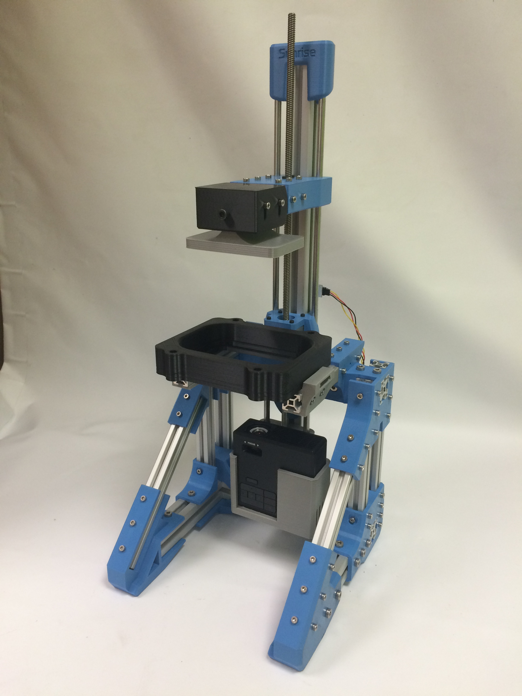

#Sunrise Project
##Introduction

The Sunrise Project is a research project, that aims to design an Open Source  hackable DLP based 3D printing system.

##Approach
The intention is to make the machine accesible to the general public. It must be sourceable, craftable, and modifiable by everyone. It aspires to be a platform for the community to explore this technology. Mechanics are scalable, source is available and modifiable, tools are open and obtainable.

##The technology

DLP 3D Printing uses photopolymierizing resin to craft the parts. Parts generate layer by layer as they are cured by a projector that outputs the cross-sections of the part, into the resin. There are various mechanical structures that can be used to achieve this.

This machine has what is called a _Bottom-Up_ structure. It has a vat, with transparent bottom, filled with resin. Underneath, an upward pointing DLP projector shoots light through the bottom window. The light striking on a **downward pointing** build surface cures the resin, forming a new layer.
Repeating this process, curing one layer below the previous one, ends up crafting the whole part, **upside down**.

##The machine

This machine tries to stick to the RepRap philosophy, so structure and moving parts are 3D printed. Motion control is performed by an Arduino with a CNCShield, running a version of [GRBL][GRBL-link] that can be found [here][Sunrise-fw].
The projector is an [Optoma ML750][Optoma-link], with hacked optics for nearer focus.
PDMS based vat and flexible bottom vat system are being considered.

##About this repo

This repo contains the mechanical structure source. The tool of use is FreeCAD.
Folder content is descripted below
* `src`: Source files and assembly.
* `Step`: Step files for CAD import.
* `stl`: stl files for 3D printing.
* `FEM`: Part file duplicates for possible FEM analysis.
* `Fonts`: Fonts used in the design of the parts.
* `doc`: useful files for documentation
* `Software`: Provisional, holds useful software until it gets big enough for it to have its own repo.

##History

###Sunrise v0.2 (in development)

####Specs (may be changed):
* Aluminium extrusion profiles + printed parts based structure. Way more rigid than v0.1.
* Hacked [Optoma ML750][Optoma-link] pico-projector.
* Expandable design, able to hold several projectors.
* [Arduino UNO][AU-link] + [CNCShield][CNCS-link] + [a modified GRBL][Sunrise-fw] for motion control.
* [Creation Workshop][CW] as slicer and projector control.

###[Sunrise v0.1][Sunrise-v0.1]

####Specs:
* Threaded rod + printed parts based structure.
* Hacked [Optoma ML750][Optoma-link] pico-projector used to save space.
* Modular setting for easy technique testing.
* [Arduino MEGA][AM-link] + [RAMPS][RAMPS-link] + [Marlin][Marlink] for motion control.
* [Creation Workshop][CW] as slicer and projector control.
* PDMS coated resin vat.

##License

This machine is licensed under a [Creative Commons Attribution-ShareAlike 4.0 International License](http://creativecommons.org/licenses/by-sa/4.0/). Please read the LICENSE files for more details.

Esta maquina tiene una licencia [Creative Commons Attribution-ShareAlike 4.0 International License](http://creativecommons.org/licenses/by-sa/4.0/). Por favor, lea los ficheros LICENSE para más detalles

[GRBL-link]: https://github.com/grbl/grbl
[Sunrise-fw]: https://github.com/bq/Sunrise-fw
[Sunrise-v0.1]: https://github.com/bq/Sunrise/releases/tag/0.1
[CW]: http://www.envisionlabs.net/
[Marlink]: http://reprap.org/wiki/Marlin
[RAMPS-link]: http://reprap.org/wiki/RAMPS_1.4
[AM-link]: https://www.arduino.cc/en/Main/arduinoBoardMega
[AU-link]: https://www.arduino.cc/en/Main/arduinoBoardUno
[CNCS-link]: http://blog.protoneer.co.nz/arduino-cnc-shield/
[Optoma-link]: http://www.optomausa.com/projectordetails.aspx?PTypeDB=Business&PC=ML750